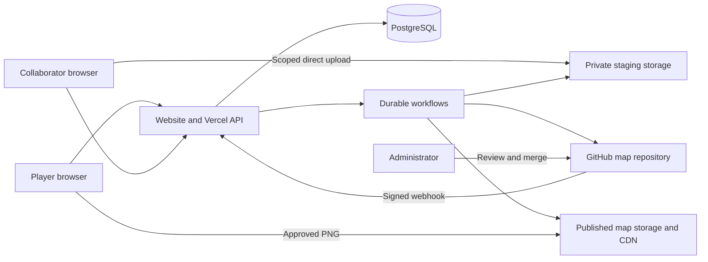

# Minecraft metro website implementation plan

Planning date: 6 October 2026. This document records the agreed design. The owner subsequently authorized bot verification, map repository initialization, and parallel website implementation. Implementation is now in this workspace; see [README.md](README.md) and [IMPLEMENTATION_STATUS.md](IMPLEMENTATION_STATUS.md) for current setup and remaining acceptance work. Historical setup records below describe the state at the time of each action.

Current owner decisions: passwords have an eight-character minimum; comprehensive local testing against the test repository will replace the separate staging acceptance run. Follow the current testing decision and focused checklist in [IMPLEMENTATION_STATUS.md](IMPLEMENTATION_STATUS.md#current-testing-decision--6-october-2026), then perform a brief deployment check for Vercel-specific behavior. Earlier password and staging requirements below are historical.

Build a website where players can view the approved metro map and submit requests or comments without learning GitHub. Approved collaborators use website accounts to upload a replacement map and open a pull request. An administrator reviews and merges that pull request in GitHub. GitHub retains the authoritative map history and discussion history.

## Decisions and assumptions

| Item | Decision |
| --- | --- |
| Hosting | Vercel, as requested. |
| Player participation | No account required for requests or issue comments. Submitted in-game names are unverified. |
| Collaborator authentication | Website accounts created or invited by an administrator, confirmed by the owner. No public registration. |
| Station coordinates | X and Z plus a free-text dimension, defaulting to the literal string `overworld`, confirmed by the owner. No Y field or fixed dimension enum. |
| Station names | Chinese name required; English name optional, confirmed by the owner. |
| Map format | Rail Map Painter (RMP), document version 80, identified from the supplied sample and the upstream save format. Browser reopening in the editor remains a review step. |
| Map editing | Continue using the existing external editor. The first release uploads exported JSON and PNG files. |
| Merge authority | Administrator manually merges in GitHub. The website creates PRs and reports their status. |
| GitHub credential | Recommend a GitHub App installation. Support a fine-grained PAT as a simpler initial configuration. |
| Repository layout | Dedicated data repository `ofts-cqm/ckocc-metro-map`, checked out locally in ignored `map-data/`; the workspace root is the future website source repository. |
| Repository visibility | The owner configured the public repository `ofts-cqm/ckocc-metro-map`, verified on 6 October 2026. Check the repository's branch protections before launch. |
| Public downloads | The website's JSON source-download route requires a collaborator account; the PNG is public. Because the owner chose a public data repository, its JSON is independently public on GitHub. Website authentication does not make that repository content private. |
| Interface languages | Ship `en-US`, `zh-CN`, and `zh-HK` in the first release, confirmed by the owner. English is the fallback; users can select and retain their preferred language. |
| Account identifier | Proposed default: email/password login plus an in-game display name. Email is private and only collaborators need it. |

At initial planning, the workspace had an empty Git repository, no commits, no remote, and no application files. There is no existing framework or application architecture to preserve. The owner subsequently supplied bot credentials and a JSON/PNG pair. The data repository is now initialized and the supplied files have standard names under `map-data/maps/`; see the setup record below.

## Recommendations on the open questions

### Anonymous requests are reasonable with limited authority

This is a sensible tradeoff for a small Minecraft community: a request or comment does not change the published map. Accept that someone can impersonate an in-game name. Describe it as a submitted name and never grant permissions, establish ownership, or reset credentials based on it.

An unadvertised URL can still be discovered or shared. The practical risks are spam, notification abuse, offensive content, and consuming the backend's GitHub quota. Use a bot challenge, persistent rate limits, input limits, and GitHub moderation. Avoid requiring players to create accounts merely to submit feedback.

Start with automatic publication of valid requests. The administrator can lock discussions, remove abusive comments, and pause anonymous submissions. If abuse becomes persistent, add a shared server invitation code or moderation queue. A future Minecraft plugin could issue one-time verification codes if verified player identity becomes useful; that integration is outside this release.

### A personal access token can perform the complete PR workflow

GitHub's REST API supports writing file blobs, creating a tree and commit, creating a branch reference, and opening a pull request. These are HTTPS requests that can run from Vercel. A Git installation, persistent checkout, and shell-based Git commands are unnecessary. Use one commit containing both files and their manifest. [Git blobs](https://docs.github.com/en/rest/git/blobs#create-a-blob), [Git trees](https://docs.github.com/en/rest/git/trees#create-a-tree), [Git commits](https://docs.github.com/en/rest/git/commits#create-a-commit), [Git references](https://docs.github.com/en/rest/git/refs#create-a-reference), [pull request creation](https://docs.github.com/en/rest/pulls/pulls#create-a-pull-request).

For a fine-grained PAT, select only the metro data repository and grant:

| Repository permission | Access | Purpose |
| --- | --- | --- |
| Contents | Read and write | Read approved files; create blobs, commits, and submission branches. |
| Issues | Read and write | Read/create requests and add comments. |
| Pull requests | Read and write | Create PRs and read their status. |
| Metadata | Read | Repository metadata; normally included automatically. |

No Actions, Workflows, repository Administration, or organization administration permissions are needed for these application operations. An administrator configures repository settings and webhooks separately. Organization approval or token policies may apply. Set an expiry and document rotation. [GitHub token permission reference](https://docs.github.com/en/rest/authentication/permissions-required-for-fine-grained-personal-access-tokens).

A GitHub App is the recommended production credential: it has its own bot identity, can be installed on just this repository, and uses installation tokens that expire after one hour. Request the same repository permissions in the table above. Its private key remains a sensitive server secret. Collaborators still use the website accounts described above; they do not need GitHub accounts. [GitHub App installation authentication](https://docs.github.com/en/enterprise-cloud%40latest/apps/creating-github-apps/authenticating-with-a-github-app/authenticating-as-a-github-app-installation).

There is no permission combination here that grants branch writing while categorically denying merges: the merge API also accepts Contents write. Enforce manual merging through application design and repository rules. A PAT belonging to the administrator acts as that administrator and may inherit their bypass rights; it provides weaker separation than a bot excluded from bypass rules. Also, a PAT creates PRs as its owner, which complicates requiring that same owner to approve their own PR. [Merge API permissions](https://docs.github.com/en/rest/pulls/pulls#merge-a-pull-request).

### The largest collaboration risk is an outdated map file

Git history makes changes traceable, but uploading whole JSON documents does not resolve simultaneous editing. Two collaborators can start from the same map and independently produce complete replacements. The website must record each edit's starting version and detect when that version becomes stale. Require reconciliation in the map editor before merging competing replacements. Do not automatically combine arbitrary map JSON.

JSON and PNG arriving together also does not prove the image represents that JSON. Validate their formats and commit them together; require the administrator to inspect the image and reopen the JSON in the original editor during review.

## Product behavior

### Home and map viewer

- Show the most recently published, merged map with pan, zoom, fit-to-screen, reset, and a full-resolution download. Support touch and keyboard controls.
- Show its revision identifier and last publication time. Never present an unmerged upload as the current map.
- Show a paginated list of open metro requests, with type, title, submitted name, date, and comment count. Provide an optional closed-request filter so players can find completed requests.
- Keep the primary buttons **Submit Update** and **Submit Request**. Submit Update directs a signed-out visitor to collaborator login, preserving their destination.
- Provide issue detail pages within the website; players do not need GitHub accounts to read or reply. A GitHub link is supplemental and may require repository access.
- Show a useful empty state before the first map is imported, and preserve the last published map during upstream outages.

### Interface languages

Support all three locales throughout the public, collaborator, and administrator interfaces from the first release:

| Locale tag | URL prefix | Language selector label |
| --- | --- | --- |
| `en-US` | `/en-us` | English (US) |
| `zh-CN` | `/zh-cn` | 简体中文 |
| `zh-HK` | `/zh-hk` | 繁體中文（香港） |

Keep one complete message catalog per locale, using stable keys for buttons, field labels, validation errors, auth/invitation screens, upload progress, workflow states, notices, empty states, and accessibility text. Use Hong Kong Traditional Chinese wording for `zh-HK`; a mechanical character conversion of the Simplified Chinese catalog is insufficient. Test matching catalog keys and review translations before launch.

Use an explicit locale in the URL, then a saved language preference, then a supported browser language to choose the interface, falling back to `en-US`. For initial browser matching, map `zh-Hans`/`zh-CN`/`zh-SG` to `zh-CN` and `zh-Hant`/`zh-HK`/`zh-MO`/`zh-TW` to `zh-HK`; use `zh-CN` for an otherwise unspecified `zh` preference. These are interface fallbacks among the supported locales. An explicit user choice always wins and persists in a cookie without requiring login. Keep API and webhook paths locale-independent.

Changing language preserves the current page, form fields, station order, edit session, and staged-upload references. Format dates and UI counts with the active locale and set the document language accordingly. Coordinates remain unambiguous signed integers. Return stable server error codes and parameters so the UI can translate them; do not expose raw provider errors as interface messages.

Preserve user-entered station names, comments, line identifiers, and dimension strings exactly after their defined validation; interface locale does not translate or transliterate them. When an English station name is absent, show its Chinese name even in the English interface. The supplied map PNG retains its embedded labels in every locale; this release does not generate three separate map images. Use a consistent English GitHub issue/PR template with original submitted content and stable machine fields; record the submission locale for context. The website renders its own structured request labels in the chosen language.

### Submit Request

First choose **General thought** or **Line update**. Both remain anonymous and show a concise notice that the submitted name and message are visible on the website and stored in GitHub.

General thought has exactly the requested primary inputs: in-game name and comment. Generate the GitHub title from a short plain-text excerpt; a separate title is unnecessary.

| Line update field | Requirement and representation |
| --- | --- |
| In-game name | Required, trimmed text. |
| Line name | Optional text. |
| Line number | Optional **string**, never a numeric database column or number-only input. Preserve values such as `01`, `2A`, `7.5`, and `Airport`. |
| Line type | Required: double-track blue ice, single-track blue ice, double-track rail, single-track rail, or other. Use stable enum keys with these display labels. |
| Operation | Required Add / Update switch. |
| Stations | Required ordered list; add, remove, and reorder rows. |
| Station Chinese name | Required text for every station. |
| Station English name | Optional text; omitted or blank input is stored as absent. |
| Station location | Required signed integer X and Z, plus a free-text dimension defaulting to `overworld`. Support custom dimension names/IDs without a fixed list. A form-level default pre-fills new station rows; existing station values remain individually editable. |
| Additional details | Optional notes, useful for explaining changes or an Other line type. |

Neither optional line identifier is made mandatory. If both are absent, generate a title from the operation, submitted name, and first/last stations. Interpret the station list as the proposed complete ordered list for that line; explain this beside the form. A contributor can use notes for removals, uncertainty, or unusual layouts.

Initial configurable limits: in-game name 1–64 characters; Chinese station name 1–120; English station name up to 120 when supplied; dimension 1–128 after defaulting; line name 120; line number 32; general comments/notes 5,000; 1–200 stations. Count Unicode characters, reject control characters where inappropriate, and preserve Chinese text. Trim surrounding whitespace in names and dimensions; normalize blank/missing English names to `null` and blank/missing station dimensions to `overworld` on the server as well as in the form. Preserve custom dimension spelling, case, spaces, and namespace punctuation such as `server:moon`; do not restrict dimensions to vanilla names, lowercase them, translate them, or prepend `minecraft:`. Coordinates must be finite safe integers; do not invent a world boundary until server settings are known. Limit the encoded API body and final generated GitHub body separately; reject excessive output with a helpful error rather than truncating it.

Create a human-readable GitHub issue with the request type, submitted name marked unverified, line attributes, station table, and notes. The backend chooses labels such as `metro-request`, `type:general`, `type:line-update`, and `operation:add` / `operation:update`. Pre-create these labels during setup. Include a backend operation marker for retry reconciliation.

### Comments on existing issues

- Prompt for in-game name and comment, with the same anonymous-submission controls.
- Read and display paginated comments, including administrator replies made directly in GitHub.
- Only allow commenting on an issue in the configured repository that is marked `metro-request`; reject PR numbers and unrelated issue numbers.
- Allow replies to open, unlocked issues. Show closed issues as read-only in the first release; GitHub issue locking also disables posting.
- Recheck the issue immediately before the write and handle it becoming closed or locked during submission.
- Anonymous users cannot edit or delete earlier messages just by entering the same name. Moderation stays with the administrator.

### Submit Update

1. Sign in with an active collaborator account.
2. Start an update from the current approved map. The server creates an edit session and records the exact base commit and map revision. Offer a download of that JSON with a versioned filename and a link to the external editor.
3. Edit externally, export the JSON, and render a PNG. Return to the same saved edit session.
4. Enter a short summary and optional details. Upload one JSON and one PNG. Select zero or more eligible open issues under **Resolve when approved**.
5. Preview the image and submission details. Show whether the starting map version is still current, plus other pending map updates.
6. Submit. Show durable progress and then the PR number/status. Keep the update available under **My updates** after navigating away.
7. Administrator reviews and manually merges in GitHub. The website subsequently publishes the approved revision and reflects the resulting issue states.

Issues close on merge into the default branch through one generated `Closes #N` line per selected issue. Opening, rejecting, or closing an unmerged PR does not close those issues. Zero selected issues is valid. Selection is explicit; user-supplied prose must not generate additional closing directives. [GitHub issue linking rules](https://docs.github.com/en/issues/tracking-your-work-with-issues/using-issues/linking-a-pull-request-to-an-issue).

If a collaborator already edited an old downloaded file without an edit session, let them identify a known starting revision before submission. If its origin is unknown, require administrator reconciliation; never silently label it as based on the current map.

For the first release, revising a submitted update means creating a new edit session and replacement PR. The administrator closes the superseded PR in GitHub. Editing PR branches from the website can be added later.

## Proposed architecture

Use Next.js with TypeScript on the Node.js runtime, a managed PostgreSQL database with pooled connections, Better Auth for local accounts, Octokit for GitHub, Vercel Blob for files, and Vercel Workflows for durable GitHub and publication tasks. These are proposed implementation choices, not pre-existing dependencies. Pin compatible stable versions and commit a lockfile during implementation.

The database supplies persistent sessions, authorization, operation state, rate limits, and caches. Do not store mutable state in Vercel's local filesystem or module-level variables. A small community can use PostgreSQL rate-limit counters initially without adding Redis.



GitHub is authoritative for map versions, issue/comment bodies, and PR status. PostgreSQL is authoritative for website accounts and workflow state. Cached GitHub records and published files can be rebuilt from GitHub. Do not introduce a second independently editable station database in this release.

Keep the website source repository separate from the map repository. The backend credential then needs access only to map data, and a map PR does not trigger a website preview deployment carrying application secrets.

Proposed data repository paths:

```text
maps/network.json
maps/network.png
maps/manifest.json
.github/workflows/validate-map.yml
README.md
```

The website may change only the three fixed `maps/` paths. Repository owner, name, base branch, file paths, and labels are server configuration, never unrestricted request parameters. The initial repository commit and CI workflow are provisioned by an administrator; GitHub cannot create branch references in an empty repository. [Git reference API](https://docs.github.com/en/rest/git/refs#create-a-reference).

The manifest contains a schema version, detected editor/format version, SHA-256 digests of both uploaded files, map revision, base map revision, base commit SHA, operation ID, contributor display name, summary, selected issue numbers, and timestamp. Define the map revision as a SHA-256 digest over an unambiguous encoding of the JSON and PNG digests. Do not include account email, password data, IP information, storage secrets, or the new commit's own SHA in the manifest.

## Authentication and permissions

Use Better Auth's credential and session handling with its PostgreSQL adapter and an explicitly configured Argon2id hash/verify implementation. Generate a fresh random salt through the password library for each password and store its encoded hash including salt and parameters. A shared salt, plaintext password, reversible encryption, or plain SHA-256 is unsuitable. Better Auth supports a custom password implementation. [Better Auth password configuration](https://better-auth.com/docs/authentication/email-password#configuration).

Start Argon2id at memory 19 MiB, two iterations, parallelism one or stronger, and benchmark on the deployed runtime. Verify that the chosen native package builds and runs on Vercel. Rehash on a successful login when parameters change. [OWASP password storage guidance](https://cheatsheetseries.owasp.org/cheatsheets/Password_Storage_Cheat_Sheet.html).

- Bootstrap the first administrator through a documented one-time operator command that prompts for secrets without logging them. Disable any public bootstrap endpoint.
- Administrator creates a single-use invitation bound to an email and role. The recipient chooses their password. Proposed expiry: 24 hours. Store only a digest of the random invitation secret.
- Administrator copies and shares the invite link through their existing communication channel; an email delivery service is not necessary for the first release. No messages are sent by this planning work.
- Disable public registration in the auth library as well as in the interface. Redemption must validate and consume an invite; a hidden sign-up form alone is insufficient. Use a server-only library adapter for account creation and test concurrent redemption.
- Proposed password length is 12–128 characters, permitting passphrases. Never trim, silently truncate, or log passwords.
- Use secure, HttpOnly, SameSite cookies over HTTPS, trusted-origin/CSRF checks, and server-validated sessions. Proposed session lifetime: seven days, with fresh authentication for account administration.
- Check active account status and role for every protected mutation, including upload-token issuance and queued work. Disabling an account or resetting a password revokes its sessions.
- Password recovery initially goes through the administrator issuing a short-lived, single-use reset link. Do not reveal an old password or email reset links to an address supplied by an unauthenticated requester.
- Protect login by both account identifier and trusted client IP; return generic credential errors. Avoid permanent account lockout that lets an attacker disable a collaborator.
- Use the library's established session schema and APIs. Do not invent a custom JWT/password protocol. Confirm actual revocation behavior in deployment tests.

| Actor | Allowed actions |
| --- | --- |
| Visitor | Read published maps and exposed requests; submit a new request or comment within controls. |
| Collaborator | Visitor capabilities; create edit sessions, upload map files, submit PRs, view their operation state. |
| Website administrator | Manage invitations/accounts, inspect failed operations, retry synchronization, pause public submissions. |
| GitHub administrator | Review and merge PRs; moderate, close, and lock issues; configure repository protections. |

## Anonymous submission controls

Use Cloudflare Turnstile on requests/comments, verified by the backend with expected hostname and action. Tokens are single-use and expire after five minutes. Validate once when accepting a new operation, record that acceptance, and do not replay a consumed token when resuming an already accepted operation. Bot verification is not proof of player identity. [Turnstile server validation](https://developers.cloudflare.com/turnstile/get-started/server-side-validation/).

Proposed initial limits, configurable after observing legitimate usage:

| Scope | Initial limit |
| --- | --- |
| New requests | 3 per hour and 10 per day per trusted IP key |
| New comments | 10 per hour and 30 per day per trusted IP key |
| Login | 5 failed attempts per 15 minutes per account/IP pair, plus an IP-wide cap |
| Collaborator uploads | 5 update submissions per hour per account; bounded staging bytes |
| Global public writes | 60 requests/comments per hour across the website |

Enforce counters atomically in persistent storage. Derive IP only from the verified deployment proxy behavior, not an arbitrary client header. Store a keyed digest for abuse counters with a short retention period; do not publish IPs in GitHub. IP limits may affect players sharing a connection and should produce a clear retry time. In-game names are unsuitable rate-limit identities.

Apply cheap request-size and rate checks before expensive work. If bot verification or the persistent limiter is unavailable, keep drafts and ask the player to retry rather than posting unchecked writes. Include a honeypot if useful, but do not treat it as the primary control.

Treat submitted text as plain text. Escape it when building Markdown, neutralize GitHub mentions and reference/closing syntax in untrusted prose, and test the resulting GitHub behavior. The website must render escaped text or a tightly sanitized Markdown subset, never raw HTML from users or GitHub. Disable arbitrary embedded images to avoid external tracking. Keep backend operation markers in a trusted template section that input cannot spoof.

On a private repository, expose only `metro-request` issues and their intended public discussion. Label removal must remove public access on refresh; invalidate cached detail pages and comments. Explain to administrators that discussions on these labeled issues are published by the website even when GitHub itself is private. Sensitive operational discussion belongs elsewhere.

## Uploads and map validation

Vercel Functions have a 4.5 MB request and response payload limit. Send files directly from the browser to storage using a backend-issued upload token; submit only file identifiers and form metadata to the application. Do not base64-encode the files into a browser-to-function JSON request. [Function limits](https://vercel.com/docs/functions/limitations), [Vercel Blob client uploads](https://vercel.com/docs/vercel-blob/client-upload).

Use a private Blob store for staged uploads and a separate public store for approved map delivery. Keep store credentials server-side. An upload token must bind the account, edit session, generated storage path, permitted content type, expiry, and maximum size. Do not permit overwrite of an accepted upload or arbitrary caller-supplied paths/URLs.

Proposed starting limits are 2 MiB JSON and 20 MiB PNG. The supplied sample fits at 198,454 bytes JSON and 7,362,193 bytes PNG. These are application limits, not provider maxima. The JSON limit allows an authenticated source download to fit within a function response; if real exports require more, design bounded authenticated chunk downloads or storage with scoped download URLs before raising it. The actual PNG is 17,577 × 9,095 pixels (159,862,815 pixels), so the initial draft's 40-million-pixel limit would reject the current map. Use proposed bounds of 24,576 pixels per axis and 200 million pixels total, with bounded sequential decoding and memory/time measurements on the deployment runtime. A four-channel decoded copy of this image alone requires roughly 610 MiB; avoid unbounded intermediate copies.

Validation steps:

1. Reauthorize the account and confirm that both stored objects belong to the edit session. Obtain size/content from trusted storage, not the browser's completion claim.
2. Enforce actual byte limits while reading. Compute file digests.
3. Decode JSON as UTF-8, parse with bounded resource usage, and validate the known editor envelope and required fields against sample fixtures. Preserve unknown fields and original file bytes; never drop fields or rewrite the document merely to make a tidier diff.
4. Reject an unsupported format/version with an actionable message. Distinguish valid JSON from a supported map document. Do not fabricate the RMP/RMG schema before inspecting a sample.
5. Verify PNG signature and perform a bounded full decode with a maintained image library. Reject corrupt data, excessive dimensions, and unsupported animated PNGs for this release. File extension and MIME type alone are insufficient.
6. Produce a small review thumbnail if needed. A private thumbnail served through a function must stay below the function response limit; a public map PNG is delivered directly by the CDN.
7. Generate the trusted manifest after validation. Preserve the uploaded JSON and PNG as a pair in the same commit.

The JSON validation adapter should expose `detectFormat`, `validateDocument`, and optionally `summarizeDocument`. The observed RMP v80 envelope contains `mapEnabled`, `graph`, `mapStyle`, `svgViewBoxZoom`, `svgViewBoxMin`, `version`, and `images`. Its graph has 395 unique nodes and 244 edges with valid endpoints; these include diagram elements and must not be reported as station/line counts. Node canvas `x`/`y` values are diagram coordinates, not Minecraft station coordinates. Only implement summaries supported by the observed format; a line/station diff is not a first-release dependency. Preserve existing multilingual labels and unknown fields. The actual JSON-to-PNG correspondence remains a human review responsibility unless a reliable renderer is later integrated. [RMP save implementation](https://github.com/railmapgen/rmp/blob/main/src/util/save.ts).

Delete abandoned/rejected staging objects after seven days, except while a live operation still needs them. Retain successfully committed originals in GitHub; staging copies can then be removed. Enforce per-account and global storage quotas. Do not put file contents, passwords, or credentials into workflow logs.

## Reliable GitHub operations

### Creating a map pull request

Use the configured repository's default branch as the PR base, so issue-closing keywords work. Discover/validate that branch during setup and fail clearly if it is renamed without corresponding configuration.

For each accepted submission:

1. Create an operation with an unpredictable ID, actor, request digest, fixed timestamp, base commit, base map revision, and uploaded object identifiers.
2. Validate files, role, selected issue eligibility, and freshness. If the current default-branch map differs from the edit session's base revision, stop with **Needs reconciliation** before creating a PR.
3. Read the tree of the recorded base commit. Create blobs for JSON, PNG (base64 for the GitHub request), and manifest.
4. Create a tree based on that existing tree with exactly the three allowed file replacements. Preserve all other repository files.
5. Create one commit using the recorded base commit as its parent. Fix metadata for retry consistency. Do not use the current branch head as a new parent for an older export.
6. Create `refs/heads/metro-update/<operation-id>` pointing to the new commit. No default-branch writes and no force pushes occur through the website.
7. Create the PR from that branch to the configured default branch. Include the contributor display name, base revision, summary, file checksums, operation marker, and generated closing directives.
8. Store the resulting commit, branch, PR number, and URL. Return **Awaiting administrator review**. A PR creation response is not a publication success.

Check for another merged map change immediately before the branch/PR step. A race after that check remains possible, so repository merge checks must enforce freshness too. Reject a pair of files identical to the approved pair as a no-op rather than creating a PR only to close issues.

### Stale map protection at merge time

Add a required `validate-map` GitHub check. It validates the allowed changed paths, manifest, checksums, actual files, and the PR's recorded base map revision against the current default-branch map. Also require the PR branch to be up to date before merging, so a check that passed before another PR merged cannot remain sufficient.

If two PRs share a base map and the first merges, the second needs reconciliation. Clicking GitHub's Update branch must not bypass this: the original base map revision remains in its manifest, and the check fails until a newly reconciled submission is made. Changes to repository documentation alone need not invalidate an edit if the approved JSON/PNG revision has not changed.

Use trusted validation code from the protected base, and never execute uploaded JSON or PR-supplied scripts. Configure GitHub Actions with minimal read permissions and without application secrets. Do not combine a privileged `pull_request_target` job with execution of untrusted PR code.

Configure rules so only the administrator can update the default branch through PRs; exclude the app from bypass actors. Keep required validation and freshness rules effective for administrator merges. If using separate rulesets for allowed merger identity and required checks, an identity bypass must not bypass validation. Verify the exact protection behavior in a test repository, including the bot attempting to merge. Repository visibility and GitHub plan affect available rules. [Available rules](https://docs.github.com/en/repositories/configuring-branches-and-merges-in-your-repository/managing-rulesets/available-rules-for-rulesets), [ruleset configuration](https://docs.github.com/en/repositories/configuring-branches-and-merges-in-your-repository/managing-rulesets/creating-rulesets-for-a-repository).

This protects recorded version lineage. It cannot prove that an uploader actually edited the correct downloaded file or preserved every station. Administrator visual review and reopening the JSON remain necessary.

### Retry and duplicate handling

Use Vercel Workflows to run bounded steps that survive request completion and can retry failures. Pass operation IDs between steps; read private inputs and credentials within server steps. The workflow platform supports durable execution, but that does not make a GitHub side effect exactly-once. [Vercel Workflows](https://vercel.com/docs/workflows).

- Require an idempotency key on issue, comment, and update submission. Store a canonical payload digest and a unique constraint on operation scope/key. Identical retries return the same operation; changed input with the same key returns a conflict.
- Give an anonymous submission a separate unpredictable receipt token to read its result. Generate this secret in the browser before the first POST, retain it for retries, and store only its digest on the server so a lost initial response remains recoverable. Do not let knowledge of an idempotency key grant access to another person's operation record.
- Record intent before external writes and each resulting GitHub identifier after success. Reserve operations with a database lease so concurrent workers do not both create content.
- For a PR timeout, look up the deterministic branch and PR by head/base before creating anything again. Branches and content-addressed objects support recovery without replaying the whole workflow blindly.
- For an issue/comment timeout, search the appropriate repository issue/comment listing, with pagination, for the exact backend marker and expected configured GitHub actor/payload. Do not rely solely on eventually indexed search.
- If GitHub may have accepted a write and reconciliation remains inconclusive, mark **Outcome unknown** for operator review. Do not retry another content-creation POST blindly. Prefer a visible recoverable operation over duplicate issues or comments.
- Respect GitHub `Retry-After` and rate-limit headers. Back off on transient errors; stop on authorization failures or invalid input. Cap attempts and expose a safe retry control to the owner/administrator.
- Persist accepted-but-not-started work before starting a workflow. An outbox reconciliation job and administrator recovery action must recover a crash between database commit and workflow launch.

Proposed update states: `draft`, `uploaded`, `validating`, `creating_pr`, `awaiting_review`, `needs_reconciliation`, `merged`, `closed_unmerged`, `failed`, `outcome_unknown`. Persist detailed step checkpoints separately from these user-facing states. Distinguish GitHub merge state from website publication state.

## Synchronization and publication

Subscribe to `push`, `pull_request`, `issues`, and `issue_comment` events. Validate the GitHub HMAC signature over raw request bytes, enforce the configured repository/installation, deduplicate by delivery ID, persist work, and acknowledge promptly. A duplicate delivery must resume unfinished processing or return the existing receipt, not lose the event. [GitHub webhook validation](https://docs.github.com/en/webhooks/using-webhooks/validating-webhook-deliveries).

On a default-branch update, the publication workflow reads the current branch head and all three map files at that same commit. It validates the manifest and file pair, copies the approved PNG to public storage using an immutable revision path, and switches one database publication pointer only after the image is ready and the source JSON is verified. Keep source JSON in GitHub or private storage. Collaborator downloads are authorized and pinned to the edit session's recorded commit; the configured public GitHub repository already exposes its JSON independently of the website.

The current image is too large to assume affordable full decoding on every phone. Generate a reduced overview for initial display, preserving the full-resolution original for download. Verify detailed zoom on mobile with the real map; use a tile pyramid for on-demand details if necessary to keep client memory bounded. Derivatives are tied to the same revision and generated with bounded decoding; never replace the original uploaded PNG with a resized copy.

Prevent out-of-order publication with a per-repository publication lock and a final recheck of the current default-branch revision before switching the pointer. An older webhook must not roll the website back after a newer merge. If the branch advances during processing, reconcile to the latest revision. An approved rollback is a new commit that restores a previous file pair with a newly generated manifest based on the current map; it should publish normally.

The current-map endpoint returns small metadata and the PNG CDN URL. Even private GitHub repositories must not send a large image through a Vercel Function response. Use revision URLs for stable caching, and invalidate only current-map metadata when the pointer changes. Tie source downloads and the published image to an explicit revision, never silently substitute a JSON file from another merge.

Keep the last good publication on any failure and show its timestamp. Make **Merged; publication pending** distinct from **Published** in collaborator/admin views. An administrator can retry publication without making another PR. Validate the initial bootstrap map through the same publication path.

Cache issue lists/details for roughly 60 seconds and invalidate them on relevant events. Paginate and filter out entries with GitHub's `pull_request` field. GitHub's issues API can include PRs. [GitHub issue API behavior](https://docs.github.com/en/rest/issues/issues).

Add a bounded read reconciliation after cache expiry for active pages, plus periodic outbox/webhook reconciliation. Deduplicate this work across requests. Do not depend on webhooks alone or on a sub-minute cron being available on a free plan; verify the selected Vercel plan's scheduling limits. A once-daily repair job plus on-demand freshness checks is sufficient for the initial low-volume site. [Vercel Cron limits](https://vercel.com/docs/cron-jobs/usage-and-pricing).

## Data and API contracts

Use migrations and explicit retention policies. Proposed application records, in addition to the auth library's own tables:

| Record | Essential contents |
| --- | --- |
| Collaborator profile | Auth user ID, display name, role, active status, timestamps. |
| Invitation/reset | Secret digest, intended account/role, expiry, consumption status. |
| Edit session | Owner, base commit and map revision, expiry/status, staged object identifiers. |
| Operation | Kind, scope/key, request digest, actor or anonymous receipt digest, state, checkpoints, GitHub IDs, lease, error, retry time. |
| Request payload | Validated typed input tied to its operation; GitHub remains authoritative for the published discussion. |
| GitHub cache | Repository/number, public eligibility, issue/comment/PR projection, fetch timestamp/ETag. |
| Publication | Commit, map revision, file hashes, immutable PNG URL, private source reference, publication time, singleton current pointer. |
| Webhook/outbox | Delivery or operation ID, processing state, attempts, next attempt time. |
| Abuse counter | Key digest, time window, count, expiry. |
| Audit record | Actor ID, action, target operation, time, outcome; no credentials or raw password/token values. |

| API surface | Authorization and behavior |
| --- | --- |
| `GET /api/map` | Public, published metadata and PNG CDN URL. |
| `GET /api/issues` | Public, paginated exposed issues; filter by state/type. |
| `GET /api/issues/:number` and `/comments` | Public after eligibility check; bounded pagination. |
| `POST /api/requests` | Anonymous controls; typed general/line payload; idempotency key. |
| `POST /api/issues/:number/comments` | Anonymous controls; name/comment; issue eligibility check. |
| `GET /api/operations/:id` | Owner/admin session or anonymous receipt credential; return a minimal projection. |
| `/api/auth/*` | Library-managed login/logout/password/session routes with sign-up restrictions. |
| `POST /api/invitations/redeem` | Valid single-use invite plus new credential; no arbitrary role/account assignment. |
| `POST /api/edit-sessions` | Active collaborator; record a server-verified base revision. |
| `GET /api/edit-sessions/:id/source` | Owning collaborator/admin; bounded JSON download from the recorded commit. |
| `POST /api/uploads/token` | Active collaborator; bind permitted upload to owned edit session. |
| `POST /api/updates` | Active collaborator; staged object IDs, summary, details, selected issue numbers, idempotency key. |
| `GET /api/updates` | Collaborator's own submissions; administrator can inspect all. |
| `POST /api/webhooks/github` | GitHub signature and configured source. |
| `/api/admin/*` | Fresh administrator session for invitations, disabling accounts, retry/sync, and public-write pause. |
| Internal workflow/repair routes | Provider authentication or dedicated service secret; never public administration endpoints. |

Use shared TypeScript schemas for browser assistance and server validation. A validated request station has `chineseName: string`, `englishName: string | null`, `x: number`, `z: number`, and `dimension: string`; dimension is never an enum. Include a validated submission locale of `en-US`, `zh-CN`, or `zh-HK` where relevant. These request schemas are separate from the external editor's JSON schema. Reject unknown write fields where practical. Return `202` for accepted operations with a receipt, `409` for stale base/key conflicts, `413` for size violations, `422` for field/format errors, and `429` with retry information for rate limits. Error responses should identify fields and safe corrective actions without exposing secrets, private repository payloads, or stack traces.

## Implementation sequence

Each milestone should leave a demonstrable result and tests for its material risks. Implementation agents should follow this sequence without re-opening settled choices unless evidence requires a change.

| Milestone | Work | Completion evidence |
| --- | --- | --- |
| 1. Inspect real data and confirm deployment inputs | Obtain one current JSON and PNG; identify editor/version; measure sizes/dimensions; confirm data repository visibility, default branch, hosting budget, and administrator identity. | JSON reopens in its editor, PNG inspected, fixtures and documented limits agreed. |
| 2. Application foundation | Scaffold Next.js/TypeScript; locale routes/catalogs and language preference; migrations and pooled PostgreSQL; server-only configuration; GitHub adapter supporting App/PAT; test tooling; mock GitHub mode; empty-map home page. | Local app boots in all three locales, typecheck/build pass, configuration fails clearly, credentials absent from browser bundle. |
| 3. Accounts | Better Auth/Argon2id, admin bootstrap, invitation redemption, login/logout, roles, reset/disable, persistent rate limiting. | Uninvited signup and collaborator admin access fail; salts differ; revoked sessions immediately lose upload access. |
| 4. Public map and discussion | Published metadata/CDN viewer, issue cache/details/comments, localized general and line forms, optional English station names, custom dimensions, Turnstile, rate limits, idempotent issue/comment operations. | Anonymous requests/comments appear once in a test repository; all locales, pagination, optional names/line fields, free-text dimensions defaulting to `overworld`, and textual line numbers work. |
| 5. Map upload and PR pipeline | Edit sessions, direct private uploads, validation, manifest, durable workflow, fixed-path atomic commit, selected-issue linking, My updates view. | A permitted collaborator creates exactly one reviewable PR containing the intended file pair; main and issue states stay unchanged. |
| 6. Review protection and publication | Trusted GitHub validation check, branch rules, signed webhooks, atomic publication, stale-edit handling, event and outbox repair. | Competing PR case is blocked; administrator merge publishes a matching pair and closes selected issues; unmerged closure publishes nothing. |
| 7. Deployment and operator handoff | Separate preview/test resources, migrations, secrets, app installation/PAT, webhook setup, bootstrap/import, monitoring, backup and rotation instructions. | Fresh staging smoke completes from anonymous request through manual merge and public map refresh. Owner reviews staging before production rollout. |

Recommended source organization: UI routes/components, shared validation schemas, server auth/authorization, GitHub adapter, storage adapter, map-format adapter, durable workflows, database schema/migrations, and integration fixtures. Keep GitHub calls out of form components so tests can exercise the full workflow with a controlled adapter.

## Acceptance tests

1. A visitor can view the approved map, submit a general thought, submit a line update, and comment on an eligible issue without signing in.
2. Chinese names survive browser, database, GitHub Markdown, and website display. Values `01`, `2A`, and `7.5` remain unchanged as line numbers. Negative X/Z values and custom dimensions such as `server:moon`, `Resource World`, and `資源界` round-trip correctly. Blank/missing dimensions become `overworld`; custom case and spelling remain unchanged.
3. General requests need only name/comment. Line requests work with either or both optional line identifiers absent and English station names absent/blank; Chinese names remain required, station order remains unchanged, and English UI falls back to the Chinese name when needed.
4. Missing or invalid challenge, exceeded limits, excessive bodies, HTML/script payloads, forged issue numbers, and untrusted closing directives cannot produce unintended GitHub actions.
5. Issue and comment pagination works beyond one GitHub page; PRs and unlabeled/private operational issues do not appear in the public request list.
6. A public caller cannot obtain an upload token, forge a collaborator role, access another user's staged file/operation, change repository paths, or invoke administrator recovery.
7. Hashing the same password twice produces different salted hashes; valid passwords verify; disabled/reset accounts lose existing sessions; an invitation can be consumed only once under concurrent requests.
8. A PNG larger than 4.5 MB can be uploaded and later viewed without passing the whole file through a function request/response. Oversize, corrupt, wrongly typed, or excessive-pixel images fail before GitHub writes.
9. One update yields one commit and one PR with the JSON, PNG, and correct manifest. Other repository paths and the default branch remain unchanged.
10. Repeated clicks, concurrent workers, and timeouts after GitHub accepts an issue/comment/PR reconcile to one result or an explicit unknown state. A failed PR step resumes without duplicating successful earlier steps.
11. Two collaborators start from revision A. After the first update to B merges, the second cannot silently replace B with an export based on A. GitHub Update branch does not clear the recorded stale-base failure.
12. Selected issues stay open before merge, close only after merge into the default branch, and remain open when a PR is closed without merging. Extra closing text in a summary cannot close additional issues.
13. Invalid signatures and foreign-repository webhooks fail. Duplicate deliveries, missed deliveries, worker restarts, and reversed delivery order preserve correct state and never republish an older revision over the latest one.
14. Publication failure retains the previous approved map. Retrying publishes the merged revision without another PR. Source downloads and the published PNG match their recorded revisions; the website's source-download API requires authentication even though the GitHub copy is public. A rollback PR restoring an older pair with an updated manifest passes validation and publishes correctly.
15. Desktop and mobile browser checks cover readable station forms, add/reorder/delete controls, keyboard navigation, map zoom, validation errors, upload progress, and safe draft preservation after an error.
16. Every core journey works in `en-US`, `zh-CN`, and `zh-HK`, including authentication and administrator screens. Catalog keys match; user-facing states/errors have translations; document language and date formats match the selection. Language selection survives reload, overrides browser preference, and switching locale preserves drafts and upload state without changing submitted text or dimensions. Review Hong Kong wording and layouts with longer translated labels.

Use unit tests for schema/template/freshness logic, integration tests for auth/storage/GitHub failure recovery, and a small browser flow for the core journeys. A real staging GitHub/Vercel smoke is required for claims about permissions, branch protection, upload limits, native password hashing, and webhook publication; mocks alone cannot establish those properties.

## Setup and operational handoff

### Register and install the GitHub App

Create the app under the personal account or organization that owns the map repository. Open **Settings → Developer settings → GitHub Apps → New GitHub App**. Set a unique name such as `CKOCC Metro Bot`, use the owner's GitHub profile as the temporary Homepage URL, and choose **Only on this account**. Leave Callback URL and Setup URL empty, and user OAuth/device authorization disabled: this backend uses installation authentication. Create the app after setting the permissions below. [Registration guide](https://docs.github.com/en/apps/creating-github-apps/registering-a-github-app/registering-a-github-app).

Set repository **Contents**, **Issues**, and **Pull requests** to **Read and write**, with **Metadata** read access; leave other permissions at no access. These are the same operation permissions documented earlier. [App permission selection](https://docs.github.com/en/apps/creating-github-apps/registering-a-github-app/choosing-permissions-for-a-github-app).

Initially disable webhook **Active** while no deployed endpoint exists. After deployment, enable it with `https://<website-domain>/api/webhooks/github`, a randomly generated secret, SSL verification enabled, and subscriptions to **Push**, **Pull request**, **Issues**, and **Issue comment**. Save the same webhook secret in the backend. Keep this webhook URL outside locale prefixes. [App webhooks](https://docs.github.com/en/apps/creating-github-apps/registering-a-github-app/using-webhooks-with-github-apps).

After creation, record the **App ID**. Under **Private keys**, choose **Generate a private key** and keep the downloaded `.pem` file securely. The implementation stores the full multiline PEM in a server-side deployment secret, with its actual newlines preserved. [Private key setup](https://docs.github.com/en/apps/creating-github-apps/authenticating-with-a-github-app/managing-private-keys-for-github-apps).

Choose **Install App**, select the repository owner, select **Only select repositories**, and install on the metro data repository. Registration and installation are separate steps. [Installation guide](https://docs.github.com/en/apps/using-github-apps/installing-your-own-github-app).

Configure `GITHUB_APP_ID`, `GITHUB_APP_PRIVATE_KEY`, `GITHUB_INSTALLATION_ID`, `GITHUB_OWNER`, `GITHUB_REPO`, `GITHUB_DEFAULT_BRANCH`, and, when enabled, `GITHUB_WEBHOOK_SECRET` in the backend. Discover the installation ID using app-authenticated `GET /repos/{owner}/{repo}/installation` or a verified installation webhook; it differs from App ID and Client ID. Octokit should mint and renew installation tokens automatically, so the operator does not manually renew hourly tokens. [Installation authentication](https://docs.github.com/en/apps/creating-github-apps/authenticating-with-a-github-app/generating-an-installation-access-token-for-a-github-app).

Configure the protected default branch separately as described above. Keep the app outside merge-bypass permissions. Creating the registration itself does not deploy a backend or activate the planned website features.

### Bot verification on 6 October 2026

Live checks using the owner's local App ID and PEM key established:

- App `ckocc-metro-bot`, owned by `ofts-cqm`, authenticated successfully; App ID `5211152` matched the local configuration.
- Installation ID `168513413` is active and restricted to the selected repository `ofts-cqm/ckocc-metro-map`.
- Both installation configuration and an issued installation token granted Contents, Issues, and Pull requests write access, plus Metadata read access.
- Repository metadata, issue-list, and PR-list reads succeeded using that installation token. The temporary token was revoked after the checks.
- The repository is public, has issues enabled, and is empty. The configured default branch is `main`, but it does not yet exist. A branch listing was empty and the commits API explicitly reported an empty repository. Bootstrap its first commit before testing submission branches and PRs.
- The App reported no subscribed webhook events. Its webhook-configuration lookup returned 404; live webhook delivery remains unverified. Configure the endpoint and subscriptions when the backend is deployed.
- No issue, comment, commit, branch, or PR was created by verification. Actual write operations and merge protections remain future staging checks.

The existing `.env` uses lowercase keys `github_app_id`, `github_client_id`, and `github_client_secret`; align configuration names during implementation. The PEM is a separate local file. App installation authentication uses the private key; a user OAuth client secret is not required for that flow. App/installation IDs are configuration identifiers, not substitutes for the private key.

Added `.gitignore` exclusions for environment secrets and private keys, and restricted the supplied `.env` and PEM to owner-only read/write permissions. Neither secret file was tracked at verification time.

### Map repository initialization on 6 October 2026

Following the owner's explicit setup request, initialized `main` in [ofts-cqm/ckocc-metro-map](https://github.com/ofts-cqm/ckocc-metro-map) with commit `0f1848d30952bd0857a265867473db8586a911bd`. The bot pushed the initial commit without force and its temporary token was revoked afterward. The local checkout is `map-data/`, with `origin` pointing to that repository and `main` tracking `origin/main`.

Renamed the supplied `可可西里26-10-6.json` and `.png` to `maps/network.json` and `maps/network.png` in the data checkout, preserving every byte. Added `maps/manifest.json`, a data README, a PR review template, `.gitignore`, and `.gitattributes`. Verified all seven remote Git blob IDs against local contents. JSON graph references and PNG chunk checksums passed; libvips decoded a review preview which was visually inspected.

The bootstrap manifest has null base revision/commit values and map revision `sha256:ea26faf2bb455a6319e236f538f1e5d3da700500e101e386a9855fa9701c1bc3`. Its exact field names and checksum algorithm are documented in `map-data/README.md`; use this existing contract when implementing updates. Further map submissions must supply real base values.

Created and verified `metro-request`, `type:general`, `type:line-update`, `operation:add`, and `operation:update` labels. The default branch currently has no enforced protection or CI validation; those remain implementation work. The bot's current permissions do not include repository Administration or Workflows, so use an administrator identity for those setup steps rather than broadening the runtime bot's permissions. No website or webhook receiver has been deployed.

### Deployment and operations

Document environment variables for database connectivity, the auth secret/base URL, GitHub owner/repository/default branch, App ID/installation ID/private key or PAT, webhook secret, private/public storage credentials, Turnstile site/secret keys, abuse-key hashing secret, and repair-job authentication. Only public site/challenge identifiers belong in browser-exposed variables. Store actual values in deployment secrets and an ignored local environment file.

Preview deployments use a test repository, test database, test storage, and their own allowed origins/webhook configuration. They must not carry production write credentials. Rotate leaked credentials, remove access for departing collaborators, and back up the database; GitHub does not contain website account/session data.

Expose safe operational status: last GitHub synchronization, last publication, pending/failed workflow counts, authentication errors, upload failures, and quota pressure. Redact auth headers, cookies, invite/reset URLs, raw IP addresses, and private storage URLs from ordinary logs. Keep operation IDs for diagnosis.

Administrator review checklist: inspect the summary and selected issues, compare previous/new PNGs, reopen the new JSON in the identified editor, check concurrent updates and freshness, then merge in GitHub. To roll back, open a PR restoring the desired JSON/PNG pair and regenerate its manifest with the current base revision; provide an operator script for this so a plain Git revert does not leave stale manifest metadata. Reverting map content does not automatically reopen issues closed by the original merge; the administrator must decide which requests to reopen.

The recurring service footprint is Vercel compute/workflows/storage, PostgreSQL, and GitHub. Do not promise a zero-cost deployment: storage transfer, workflow activity, image size/history, private-repository protection availability, and traffic affect plan requirements. Confirm actual provider plans during deployment setup.

## Deliberate first release boundaries

Keep the first release focused on approved map display, public requests/comments, collaborator accounts, upload-to-PR, manual GitHub review, and reliable publication. An embedded map editor, automatic JSON merging, routing/navigation, a searchable normalized station database, Minecraft identity verification, automatic PNG rendering, user email notifications, and a custom website merge interface are later features.

The JSON/PNG samples have been inspected and the data repository is initialized. Remaining owner inputs are deployment accounts/budget and initial website administrator identity. These do not block scaffolding or mocked workflow development. The confirmed account, coordinate, optional-name, and locale choices above should carry into implementation; use the existing manifest and map fixtures in `map-data/`.
